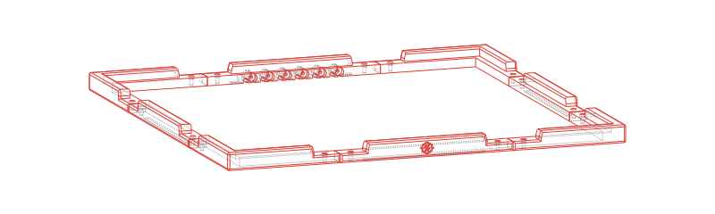

# Stealthchanger Panorama Tophat

## BOM

- ACRIFIX® 1R 0192 or equivalent
- Reused top panel
- Foam tape from Voron build
- Additional acrylic panels for the side
  - Width/length the same as the top panel
  - For two of the four panels subtract 2x your panel thickness
  - For height depending on your build size
    - 300 spec: 180mm
    - 350 spec: 200mm
- 16x M3x12 SHCS
- 16x M3 Hammerhead nut
- M10 PTFE fitting (2x per toolhead)

## Custom Specs

Modify the file in `./src/export.py` to your needs and run it.
